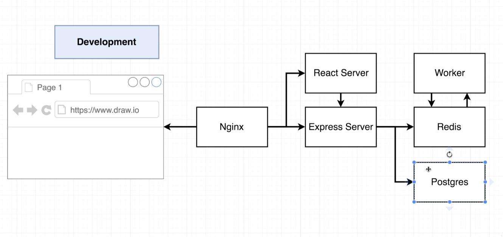
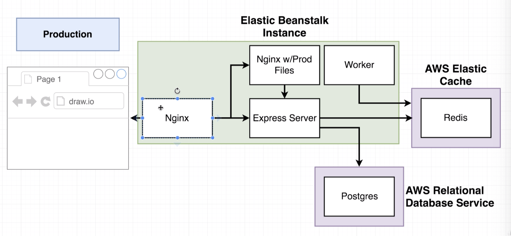

### `Dockerrun.aws.json`

* `"hostname"` in `"containerDefinitions"`: same idea as in docker-compose
* `"essential"`: if true, all containers are stopped if this one crashes. At least one container has to be marked `essential`.
* The reason why the `hostname` of the container `server` is `api` is that we called it so in nginx's `default.conf`:
  
  ```json
  upstream api {
     server api:5000;
  }
  ```
  
  `api` is what nginx will look for when it tries redirecting trafic upstream to our container `server`.
* Why do we need to specify `"links"` under `nginx`? They refer to the `name` property of the other containers. So that nginx can access the other services, this works automatically in docker-compose. 
* Note that in the `docker-compose.yml` we had an image for postgresql and redis, however we don't have these containers in elastic beanstalk! Instead we use managed services by AWS which are easier to set up, likely have better security, easier to scale up and migrate, and which have automatic backups.


* For every region you get one default VPC (Virtual private cloud). This is like a private network in which your elastic beanstalk, Database, and elastic cache (redis) instances can talk to each other.
* To get our services to talk to each other in this VPC you have to create a custom *security group* (firewall rules). 